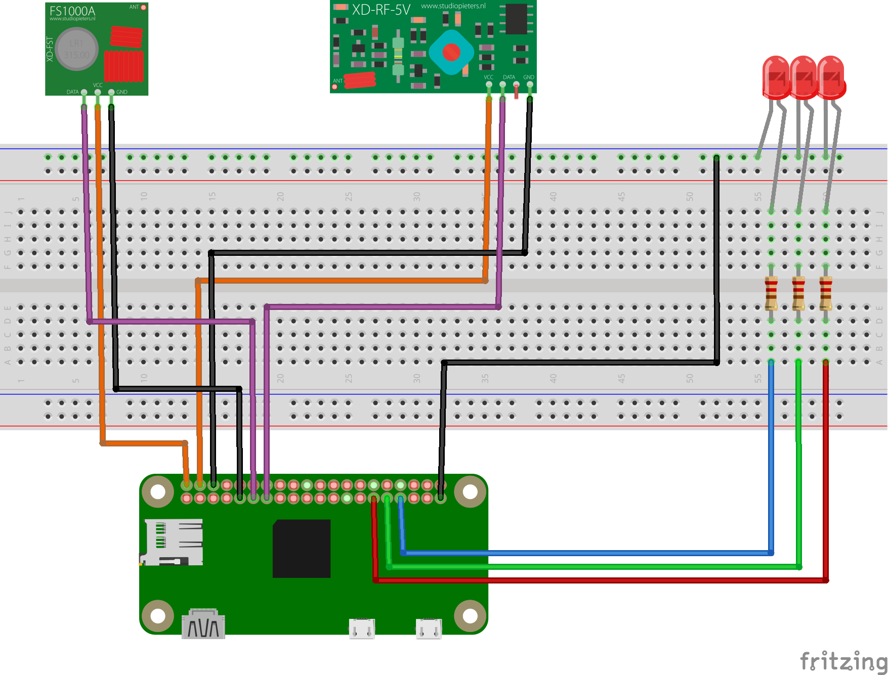

# Kiss-Light

Yet another RF outlet controller, where it is controlled from a Raspberry Pi, and the client is a simple command line application.

The idea is essentially make it as simple as possible, but still have useful functionality that could easily be used in home automation or just used standalone for DIYers.

It should be noted that this project is used in conjunction with 433MHz RF modules, it could probably work with 315MHz RF Modules, but that has not been tested currently.

let's dive right into it.

## Wiring



The wiring can be done with either the Raspberry Pi 0 W (as shown), or with any
Raspberry Pi with 40 pins. Though this has not been tested with a Raspberry Pi 4 yet.

Make sure to have 3 different colored LEDs, the 3 red LEDs on the diagram are there to indicate that LEDs are a part of this project.

Wiring scheme:

- Red wire is for the small error status LED
- Green wire is for the all good status LED
- Blue wire is for the busy status LED
- Purple wire is for Transmitter and Receiver Data
- Orange wire is for 5V
- Black wire is for Ground

## Installation (server)

make sure the following is installed (on a Raspberry Pi or compatible SBC) prior:

- wiringPi
- sqlite3
- apache2

then, just run the following:

```shell
make
sudo make install
```

And the program should be up and running after the sudo make install step.

## Installation (client)

Make sure GoLang is installed, and is at least version 1.6 or later.

All that is needed is the IP addresss the Raspberry Pi (or compatible SBC) kisslight server has,
and to set this ip address in `client/kl-client.ini` in the `ipaddr` variable:

Once the ip address of the kisslight server has been set, installation can be done like so:

```shell
make client-install
```

Uninstallation of kisslight client can be done as well:

```shell
make client-uninstall
```

## Using Telnet and How Server Works

It should be noted that numbers here are in decimal, unless otherwise specified.

The default port for this server is ```1155```, so make sure to use that port, or whatever is set in the configuration for this program when using telnet.

Once connected, the following will transmit the given RF code with the given pulse:

```plaintext
Template:
TRANSMIT <code> <pulse> KL/<version#>
KL/<version#> 200 Custom Code Sent

Example in practice:
TRANSMIT 5592371 189 KL/0.2
KL/0.2 200 Custom Code Sent
```

A code and its pulse is acquirable from an RF Remote (for example) that may control
another desired outlet:

```plaintext
Template:
SNIFF KL/<version#>
KL/<version#> 200 Sniffing
<enter desired button from RF remote>
KL/<version#> 200 Code: <code> Pulse: <pulse>

Example in Practice:
SNIFF KL/0.2
KL/0.2 200 Sniffing
<enter desired button from RF remote>
KL/0.2 200 Code: 5592380 Pulse: 188
```

Once On and Off codes have been recorded somewhere, it is possible to save
those to the server's database. As of version `0.2` however, it is now
possible to only need the On code or Off code to save it, as demonstrated:

```plaintext
Template:
ADD <device name> <On or Off code> <pulse> KL/<version#>
KL/<version#> 200 Device <device name> Added

Example in practice:
ADD lamp 5592371 189 KL/0.2
KL/0.2 200 Device lamp Added
```

Toggling the saved device can be done as follows:

```plaintext
Template:
TOGGLE <device name> KL/<version#>
KL/<version#> 200 Device <device name> Toggled

Example in practice:
TOGGLE lamp KL/0.2
KL/0.2 200 Device lamp Toggled
```

Explicitely setting the saved device on or off is now doable
as of KL version `0.2`:

```plaintext
Template:
SET <device name> <ON or OFF> KL/<version#>
KL/<version#> 200 Device <device name> <On or Off>

Example in Practice:
SET lamp ON KL/0.2
KL/0.2 200 Device lamp On

or

SET lamp OFF KL/0.2
KL/0.2 200 Device lamp Off
```

Suppose there are several devices added, and it is desired
that a client knows what devices exist on the server, here
is how it can be done:

```plaintext
Template:
LIST KL/<version#>
KL/<version#> 200 Number of Devices n
(n line of device names, up to 30 currently)

Example in Practice:
LIST
KL/0.2 200 Number of Devices 1
lamp
```

Deleting a device can also be done as follows:

```plaintext
Template:
DELETE <device name> KL/<version#>
KL/0.2 200 Device <device name> Deleted

Example in Practice:
DELETE lamp KL/0.2
KL/0.2 200 Device lamp Deleted
```

Finally, exiting from the server fairly cleanly is also doable:

```plaintext
Q
KL/0.2> 200 Goodbye
Connection closed by foreign host.
computer ~ $
```

****version#** is currently ```0.2```*

## Client Usage

Now that the server has been covered in a fair amount of detail, time for the client.

Like the rest of the project, the client is still being worked on as well.

The usage currently looks like this:

```shell
computer ~ $ kl-client
Usage: kl-client set <device name> on|off
                   toggle <device name>
                   send <code> <pulse>

Adding/deleting devices can be done as follows:

Usage: kl-client add <device name> ([--manual|-m] <on or off code> <pulse>)
                   delete <device name>
                   list

Entering scan mode can be done using the following:

Usage: kl-client scan
```

### Example usages of each command

Add device(s):

```shell
computer ~ $ kl-client add outlet0
Scanning, please press the desired button <enter desired button from RF remote>
Scanning successful, attempting to add device 'outlet0'
Added Device 'outlet0' Successfully
computer ~ $ kl-client add outlet1 -m 5592380 189
Added Device 'outlet1' Successfully
```

Set device On or Off directly:

```shell
computer ~ $ kl-client set outlet0 on
Successfully Set Device 'outlet0' on
computer ~ $ kl-client set outlet0 off
Successfully Set Device 'outlet0' off
```

Toggle device:

```shell
computer ~ $ kl-client toggle outlet0
Toggled Device 'outlet0' Successfully
```

Send custom code:

```shell
computer ~ $ kl-client send 5592371 189
Transmitted code:5592371 pulse:189 Successfully
```

Scan (or sniff) RF signal from RF remote to receiver:

```shell
computer ~ $ kl-client scan
Scanning, please press the desired button
Scanning successful, Code=5592380, Pulse=189, Off was scanned.
computer ~ $ kl-client scan
Scanning, please press the desired button
Scanning successful, Code=5592371, Pulse=189, On was scanned.
```

List available Devices:

```shell
computer ~ $ kl-client list
Here is the list:
outlet0
outlet1
```

Finally, delete device:

```shell
computer ~ $ kl-client delete outlet1
Deleted Device 'outlet1' Successfully
```

and that covers at least what would be seen when each command is run succesfully. Anything may very well change in the client, but at least the server should remain largely as is, how devices get added may change though.

## Credits

[HamletXiaoyu](https://github.com/HamletXiaoyu) for socket poll demo. [[repo](https://github.com/HamletXiaoyu/socket-poll)]

[timleland](https://github.com/timleland) for the RCSwitch code [[repo](https://github.com/timleland/rfoutlet)] [[blog](https://timleland.com/wireless-power-outlets/)]

[jirihnidek](https://github.com/jirihnidek) for example daemon [[repo](https://github.com/jirihnidek/daemon)]

[benhoyt](https://github.com/benhoyt) for ini parser [[repo](https://github.com/benhoyt/inih)]

others I may have missed...
