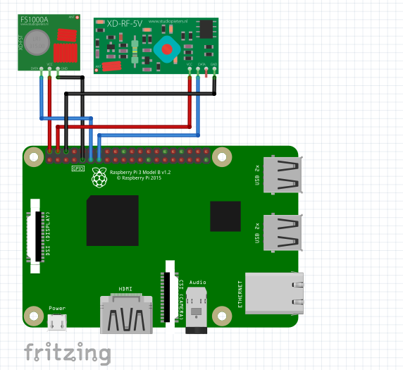

# Kiss-Light

Yet another RF outlet controller, where it is controlled from a Raspberry Pi, and the client is a simple command line application.

The idea is essentially make it as simple as possible, but still have useful functionality that could easily be used in home automation or just used standalone for DIYers.

It should be noted that this project is used in conjunction with 433MHz RF modules, it could probably work with 315MHz RF Modules, but that has not been tested currently.

let's dive right into it.

# Wiring



Wire it up exactly as shown, and it should work.

# Installation (server)

This project is a work in progress, currently runs as a standalone application,
though now it can run as a daemon if desired.

make sure the following is installed (on a Raspberry Pi or compatible SBC) prior:
- wiringPi

then, just run the following:
```
$ make
$ sudo ./server
```

alternatively, we can run the program as a daemon now:

```
$ make
$ sudo ./server daemon
```

# Installation (client)

Make sure GoLang is installed, and is at least version 1.6 or later.

For now, this requires you to know what the specific codes are to control your RF outlet,
the pulse it is okay with, and what IP addresss the Raspberry Pi server has.

Once the code over in ```src/client/client.go``` has the mentioned info, the client can be built as follows:
```
$ make client
$ ./client
```

This makes it so there is less to type, but we can alternatively control the device via telnet.

# Using Telnet and How Server Works

It should be noted that numbers here are in decimal, unless otherwise specified.

The port currently being used for this server is ```1155```, so make sure to use that particular port for this program when using telnet.

Once connected, the following will transmit the given RF code with the given pulse:
```
TRANSMIT 5592371 189
KL/0.1 200 Custom Code Sent
```

We can also get a code from an RF Remote (for example) that may control
another desired outlet: 
```
SNIFF
KL/0.1 200 Sniffing
<enter desired button from RF remote>
KL/0.1 200 Code: 5592380 Pulse: 188
```

Finally, exiting from the server fairly cleanly is also doable:
```
Q <or QUIT>
KL/0.1 200 Goodbye
Connection closed by foreign host.
computer ~ %
```

# Credits

[HamletXiaoyu](https://github.com/HamletXiaoyu) for socket poll demo. [[repo](https://github.com/HamletXiaoyu/socket-poll)]

[timleland](https://github.com/timleland) for the RCSwitch code [[repo](https://github.com/timleland/rfoutlet)] [[blog](https://timleland.com/wireless-power-outlets/)]

[jirihnidek](https://github.com/jirihnidek) for example daemon [[repo](https://github.com/jirihnidek/daemon)]

[benhoyt](https://github.com/benhoyt) for ini parser [[repo](https://github.com/benhoyt/inih)]

others I may have missed...